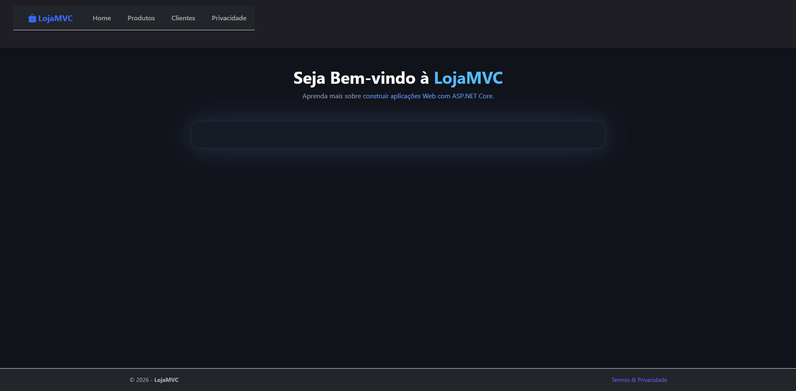
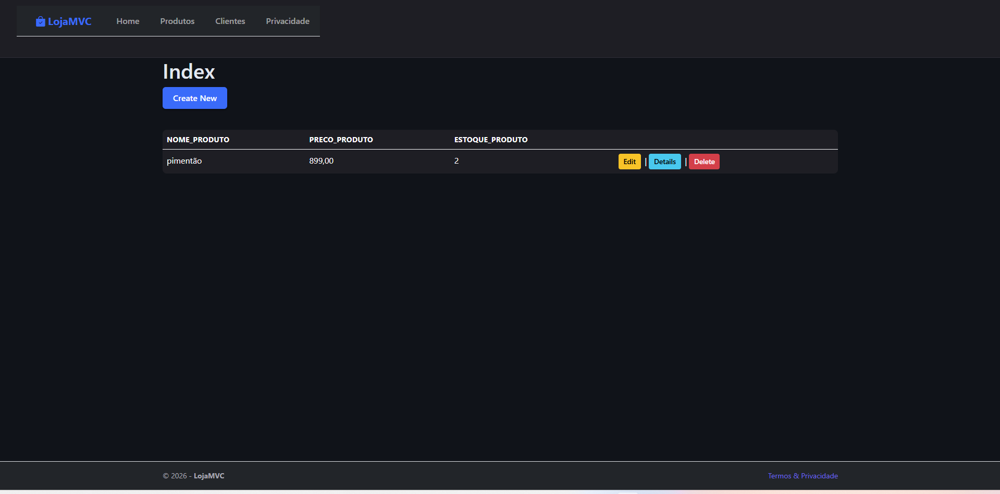

# 🛒 LojaMVC

Sistema desenvolvido em **ASP.NET Core MVC** utilizando a linguagem **C#**, o padrão arquitetural **Model-View-Controller (MVC)** e a metodologia de desenvolvimento guiado por testes (**TDD**).

O projeto tem como objetivo demonstrar a implementação de uma loja virtual com sistema CRUD (Create, Read, Update e Delete) para gerenciamento de produtos e pedidos, aplicando boas práticas de desenvolvimento, testes unitários, persistência de dados com Entity Framework Core e interface responsiva com Bootstrap.

---

## 📋 Tecnologias Utilizadas

- C#
- .NET
- ASP.NET Core MVC
- SQL Server
- Entity Framework Core
- Bootstrap 5
- jQuery
- DataTables (Paginação, pesquisa e ordenação)

---

## 🧪 Desenvolvimento Guiado por Testes (TDD)

O projeto adota a prática de **TDD (Test-Driven Development)** para garantir a confiabilidade, testabilidade e qualidade do código.

- **xUnit**: Framework de testes unitários utilizado para estruturar e rodar a suíte de testes.
- **Moq**: Biblioteca de mocking utilizada para simular comportamentos e isolar as dependências (como os repositórios do banco de dados).

O desenvolvimento seguiu o ciclo **Red-Green-Refactor**:
1. 🔴 **Red:** Escrita dos testes unitários antes da implementação da regra de negócio.
2. 🟢 **Green:** Implementação do código mínimo necessário para aprovar os testes.
3. 🔵 **Refactor:** Melhoria e organização do código mantendo a aprovação em 100% dos testes.

---

## 📦 Pacotes Utilizados

O projeto utiliza os seguintes pacotes do NuGet:

- Microsoft.EntityFrameworkCore
- Microsoft.EntityFrameworkCore.Tools
- Microsoft.EntityFrameworkCore.Design
- Microsoft.VisualStudio.Web.CodeGeneration.Design
- xunit
- Moq

---

## 🗄️ Banco de Dados

O banco de dados foi desenvolvido utilizando o **SQL Server**.

A criação da estrutura do banco foi realizada através da abordagem **Code First**, utilizando **Migrations** do Entity Framework Core.

---

## 🚀 Funcionalidades

- Cadastro, alteração, exclusão e consulta de produtos
- Gerenciamento de estoque e pedidos
- Testes unitários para regras de negócio e validações
- Paginação e pesquisa dinâmica
- Ordenação de colunas
- Interface responsiva

---

## 🎨 Interface

A interface foi desenvolvida utilizando:

- Bootstrap
- Razor Views
- jQuery
- DataTables

---

# 📷 Telas do Sistema

## Tela Inicial



---

## Ações / Gerenciamento



---

# ▶️ Como Executar o Projeto

## Clone o repositório

```bash
git clone [https://github.com/peterLEWISoLiVer/LojaMVC.git](https://github.com/peterLEWISoLiVer/LojaMVC.git)
